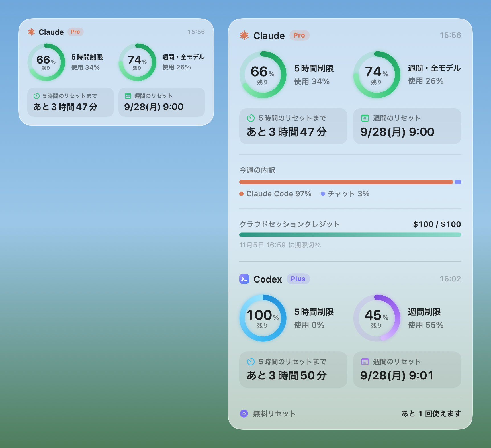
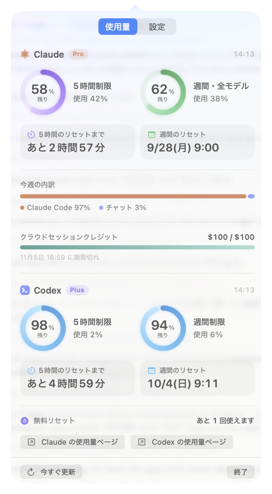
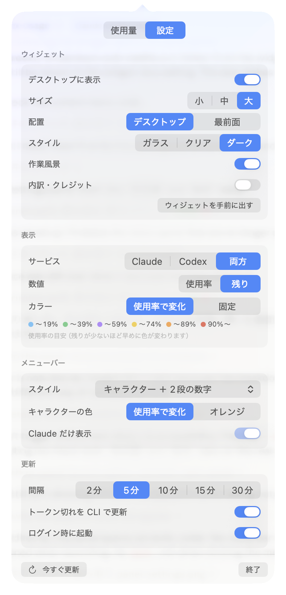
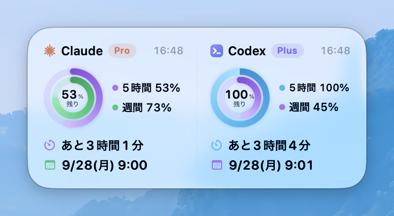
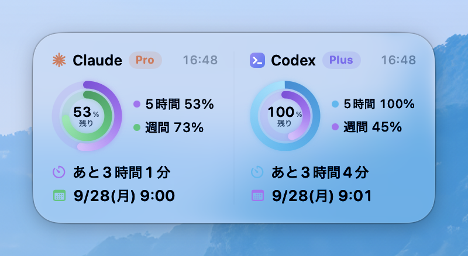
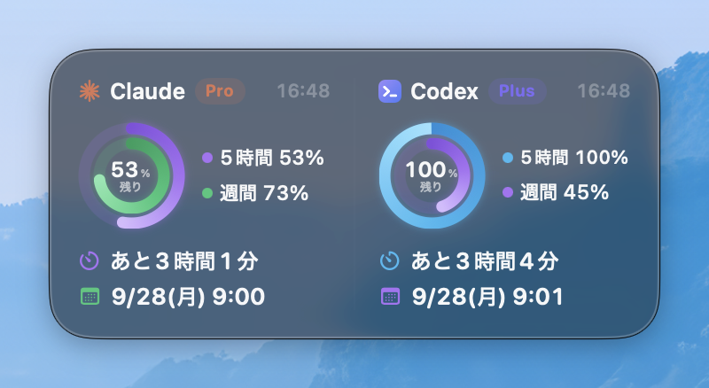
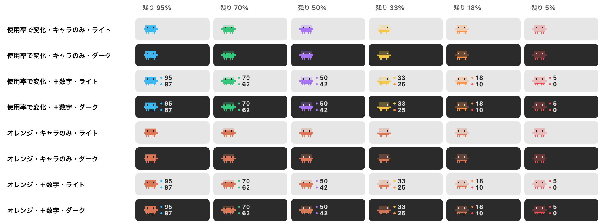
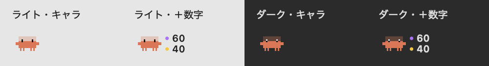
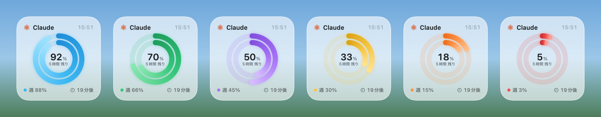
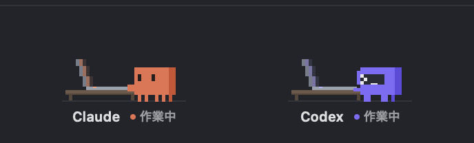

# Claude & Codex Usage

Claude と Codex の使用量（5時間制限・週間制限）を、Mac のデスクトップウィジェットとメニューバーに表示します。

- **デスクトップウィジェット**: Liquid Glass 風。小・中・大の3サイズ（大は文字やリングも 1.25 倍）。「Claude と Codex」を選ぶと、2サービス用のレイアウトに切り替わります
- **メニューバー**: サービスごとにリングと % を表示（リングの中にマーク: ✳︎ = Claude、›_ = Codex）。クリックすると詳細と設定

> **非公式アプリです。** Anthropic・OpenAI とは関係ありません。「Claude」「Codex」の名称とキャラクターは各社の商標・著作物です。



## パネル（使用量と設定）

メニューバーのキャラクターをクリック、またはウィジェットを右クリックすると、パネルが開きます。上のタブで「使用量」と「設定」を切り替えます。設定はクリックしてもパネルが閉じないので、続けて変更できます。パネルの外をクリックすると閉じます。

| 使用量 | 設定 |
|:---:|:---:|
|  |  |

今週の内訳とクラウドクレジットは、普段はパネルの「使用量」だけに表示します。ウィジェットにも出したい場合は、設定の「内訳・クレジット」をオンにします。

## ウィジェットのスタイル

パネルの「設定 → スタイル」で切り替えられます（画像は「中」サイズ・Claude と Codex 両方の表示）。

| ガラス | クリアガラス | ダーク |
|:---:|:---:|:---:|
|  |  |  |

## 動作環境

| 必要なもの | 内容 |
|---|---|
| Mac | **macOS 26 (Tahoe) 以降**、Apple シリコン（M1 以降） |
| ビルド用ツール | Xcode Command Line Tools（`xcode-select --install` で入ります。Xcode 本体は不要） |
| Claude | [Claude Code](https://claude.com/claude-code) CLI をインストールし、Pro / Max プランでログイン済み（`claude auth login`） |
| Codex（任意） | [Codex CLI](https://github.com/openai/codex) をインストールし、ChatGPT アカウントでログイン済み。使わない場合は「Claude のみ」に設定 |

Windows / Linux では動きません。

## インストール

```bash
git clone https://github.com/mizumori-24522/claude-codex-usage.git
cd claude-codex-usage
./build.sh install
```

`~/Applications/ClaudeCodexUsage.app` が作られて起動します。初回はメニューバーにキャラクターが出るので、クリックして開くパネルの「設定」タブから変更できます。

## メニューバーの表示スタイル



パネルの「設定 → メニューバー → スタイル」から選べます。

- **キャラクター**: Claude Code のピクセルキャラクターが、5時間の残量に応じて下から満ちていきます（脚は常に色つき、体が水位のように変化）。頭と縦長の目、腕、4本の脚をキャラクターの輪郭に合わせています。待機中は約7秒おきにまばたきし、Claude の使用量を更新中は小さく跳ねながら足踏みします
- **キャラクター ＋ 2段の数字**: 上の段が5時間、下の段が週間
- **リングのみ／ミニバー／2段の数字**: コンパクト表示
- **リング ＋ %／いちばん余裕のない1つだけ** など

キャラクター系のスタイルは常に Claude を表示します。Codex はメニューを開いたときのカードで確認できます。キャラクターの色は「使用率で変化（水色 → 緑 → 紫 → 黄 → 橙 → 赤）」と「Claude オレンジ」から選べます。

macOS の「視差効果を減らす」が有効なときは、まばたき・跳躍・足踏みを止めて静止表示します。数値はアニメーション中も同じ位置に表示します。



## 色の意味（既定の「使用率で変化」の場合）



上限に近づくほど段階を細かくして、注意の色が早めに出るようにしています。

| 残り | 使用 | 色 |
|---|---|---|
| 81〜100% | 0〜19% | 水色：たっぷり |
| 61〜80% | 20〜39% | 緑：OK |
| 41〜60% | 40〜59% | 紫：半分くらい |
| 26〜40% | 60〜74% | 黄：ほどほど |
| 11〜25% | 75〜89% | 橙：注意 |
| 0〜10% | 90〜100% | 赤：もうすぐ上限 |

「数値の表示」を「残り」にしても、色は使用率を基準に決まります。「カラー → 固定」を選ぶと、サービスごとの固定色になります（90% 以上だけ赤）。

## 使い方

### ウィジェットの作業風景（試作）

ウィジェットの下側に、Claude と Codex が机の端末に向かう作業風景を表示します。パネルの「設定 → 作業風景」で切り替えられます。

- **作業中**: こちらを向いたまま片手でキーボードを打ち、端末の画面のコードが流れます。
- **確認待ち**: 手を止め、「!」を出して待ちます。
- **完了**: 一度だけ軽く跳ね、画面にチェックマークが出ます。
- **待機中／未検出**: 作業の動きを止めます（未検出のときは色が薄くなります）。

動きは「設定 → 作業風景の動き」で選べます。**片手で入力**（上の説明。作業中は画面がゆっくり光ります）と、**ノートPC**（低い机のノートパソコンに横向きで打ち込み、完了で画面が緑、確認待ちで黄色になります）の2種類です。

Claude の色（キャラクターと、5時間・週間のリング）は、パネルの「設定 → メニューバー → Claude の色の段階」で編集できます。初期値は、水色 → 緑 → オレンジ → 紫 → 黄 → 白 です。ウィジェットが他のウインドウに完全に隠れている間は、動きを止めて負荷を抑えます。

この Mac に保存される Claude Code と Codex のセッション記録を読み、開始・終了などのイベントから状態を推定します。使用量の更新中とは別の表示です。会話の文章を表示・送信したり、Claude／Codex の設定を変更したりしません。

ローカルの Claude Code（Claude アプリ内の Code を含む）と Codex が対象です。通常の Claude チャット、クラウドや別の Mac の作業は対象外です。ログの形式、更新の遅延、確認待ちの種類によって判定できない場合があります。macOS の「視差効果を減らす」が有効な場合は静止表示になります。



| 操作 | 動作 |
|---|---|
| ウィジェットをクリック | 背面にあるときは手前に出る（ほかの場所をクリックすると背面に戻る）。メニューの「ウィジェットを手前に出す」でも可 |
| ウィジェットをドラッグ | 移動（位置は保存） |
| ウィジェットをダブルクリック | 今すぐ更新 |
| ウィジェットを右クリック | パネルを開く（メニューバーから開くものと同じ） |

設定: 表示するサービス（Claude のみ／Codex のみ／両方）、サイズ、配置（デスクトップ／最前面）、スタイル、カラー、数値の表示（使用率／残り）、メニューバー表示、更新間隔、ログイン時に起動

## 仕組み

**Claude**
1. Claude Code CLI がキーチェーンに保存しているトークン（`Claude Code-credentials`）を `/usr/bin/security` で**読むだけ**です（書き込みはしません）。
2. `https://api.anthropic.com/api/oauth/usage` を呼びます（デスクトップアプリの「残りの使用量」と同じデータです）。
3. トークン切れ（約8時間ごと）のときは、`claude -p "ok" --model haiku`（ツールなし）を実行して、CLI 自身にトークンを更新させます。1回あたり数百トークン程度で、実行は最大15分に1回です。この動作は設定でオフにできます。

**Codex**
- Codex CLI の公式インターフェース `codex app-server`（JSON-RPC）に `account/rateLimits/read` で問い合わせます。認証は Codex CLI が自分で行うため、このアプリはトークンに触れません。1回あたり約1.5秒です。

**「混雑中・16:10 に自動で再取得」と出たとき**: Claude の使用量 API から「リクエストが多すぎる」と言われた状態です。表示中の数値はそのまま使えます。書かれた時刻になると自動で再取得するので、何もしなくて大丈夫です（その間に手動で更新しても、リクエストは送りません）。

**しばらく起動していなかった場合**: 起動時や Mac のスリープ解除時に、すぐ最新の値を取得し直します。ただし Claude CLI のログイン自体には期限（約4週間）があります。トークンを更新しても期限は延びません。期限の3日前からメニューに警告が出るので、そのときはターミナルで `claude auth login` を実行してください。

注意: Claude のエンドポイントは非公開 API で、`codex app-server` も実験的機能扱いです。どちらも将来の仕様変更で表示できなくなる可能性があります。

## ビルド

Xcode は不要です（Command Line Tools だけでビルドできます）。

```bash
./build.sh install   # ビルド → ~/Applications にコピー → 起動
```

キャラクターの各コマは、ネットワークに接続せずに確認できます。

```bash
build/ClaudeCodexUsage.app/Contents/MacOS/ClaudeCodexUsage --character-animation build/animation-preview
```

作業風景はサンプルデータでオフライン描画できます。状態検知だけの確認も、使用量 API を呼び出さずに行えます。

```bash
build/ClaudeCodexUsage.app/Contents/MacOS/ClaudeCodexUsage --work-scenes build/work-scenes
build/ClaudeCodexUsage.app/Contents/MacOS/ClaudeCodexUsage --activity
```

## アンインストール

```bash
pkill -x ClaudeCodexUsage; rm -rf ~/Applications/ClaudeCodexUsage.app; defaults delete local.claudecodexusage
```

「ログイン時に起動」をオンにしている場合は、先にメニューからオフにしてください。

## 参考

- [steipete/CodexBar](https://github.com/steipete/CodexBar): 同じ Claude OAuth エンドポイントと、`codex app-server` の RPC を使うメニューバーアプリ
- [nicholaspsmith/claude-usage-menubar](https://github.com/nicholaspsmith/claude-usage-menubar) など

## ライセンス

MIT License（[LICENSE](LICENSE)）
