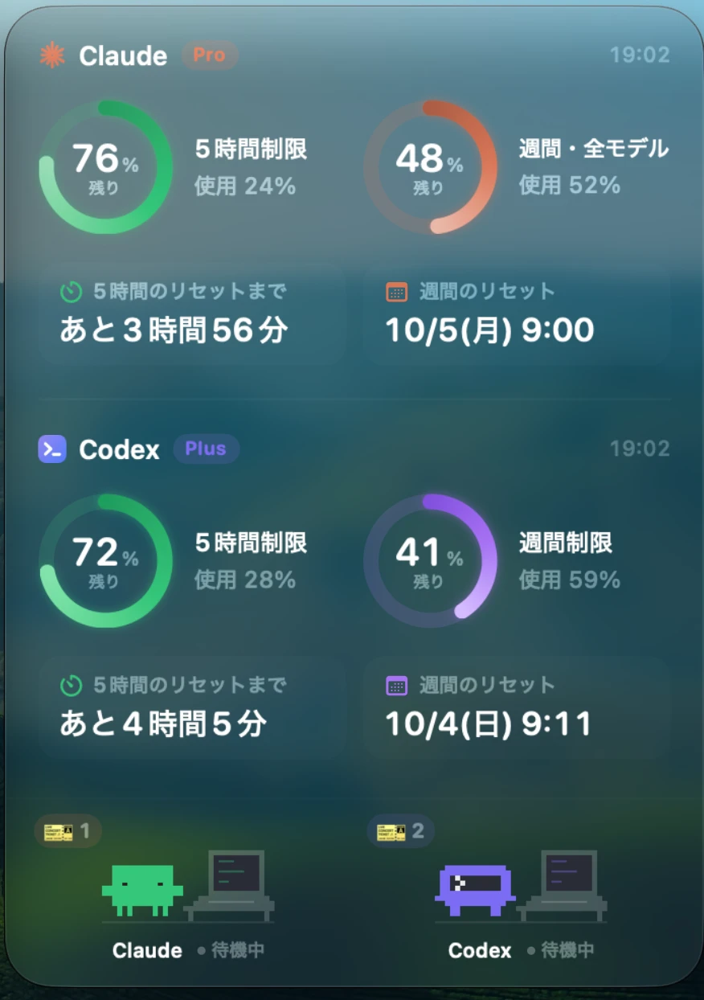
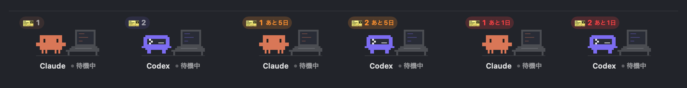
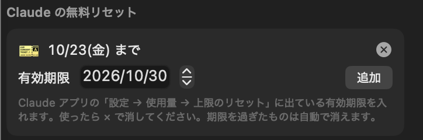

# Claude & Codex Usage

Claude と Codex の使用量（5時間制限・週間制限）を、Mac のデスクトップウィジェットとメニューバーに表示します。



- **ウィジェット**: 残量のリング、リセットまでの時間、作業中のキャラクター、無料リセットの 🎫
- **メニューバー**: Claude のキャラクターやリングで残量を表示。クリックで詳細と設定

> **非公式アプリです。** Anthropic・OpenAI とは関係ありません。「Claude」「Codex」の名称とキャラクターは各社の商標・著作物です。

> 🔰 **このアプリができるまで**：AI への指示の出し方や、Claude と Codex を連携させた方法を [制作記録（docs/making-of.md）](docs/making-of.md) にまとめています。

## 動作環境

| 必要なもの | 内容 |
|---|---|
| Mac | **macOS 26 (Tahoe) 以降**、Apple シリコン（M1 以降） |
| ビルド用ツール | Xcode Command Line Tools（`xcode-select --install`。Xcode 本体は不要） |
| Claude | [Claude Code](https://claude.com/claude-code) CLI に Pro / Max プランでログイン済み（`claude auth login`） |
| Codex（任意） | [Codex CLI](https://github.com/openai/codex) に ChatGPT アカウントでログイン済み |

## インストール

```bash
git clone https://github.com/mizumori-24522/claude-codex-usage.git
cd claude-codex-usage
./build.sh install
```

`~/Applications/ClaudeCodexUsage.app` が作られて起動します。更新するときは `git pull` してから `./build.sh install` をもう一度実行します。

## パネル（使用量と設定）

メニューバーのアイコンをクリック、またはウィジェットを右クリックすると開きます。

| 使用量 | 設定 |
|:---:|:---:|
|  |  |

## ウィジェット

| 操作 | 動作 |
|---|---|
| クリック | 背面にあるときは手前に出す |
| ドラッグ | 移動 |
| 右下か左下の角をドラッグ | 大きさを変える（70〜200%） |
| ダブルクリック | 今すぐ更新 |
| 右クリック | パネルを開く |

サイズ（小・中・大）とスタイルは「設定」で切り替えます。

| ガラス | クリアガラス | ダーク |
|:---:|:---:|:---:|
|  |  |  |

### 無料リセット（🎫）

配られた「無料リセット」の残り回数を、キャラクターの上に 🎫 で表示します。期限の7日前からオレンジ、2日前から赤になります。



- **Codex**: 自動で取得します
- **Claude**: API から取れないため手で入力します。Claude アプリの「設定 → 使用量 → 上限のリセット」の有効期限を、パネルの「設定 → Claude の無料リセット」に入れ、使ったら × で消します



### 作業風景

この Mac の Claude Code と Codex のセッション記録から、作業中・確認待ち・完了を読み取ってキャラクターで表示します。会話の内容は表示・送信しません。


- 完了したのにまだそのアプリを開いていないときは、頭の上に**青い丸**が付きます
- 「設定 → ChatGPT アプリの作業も検知」をオンにすると、ChatGPT アプリで開いているチャットの処理中も Codex に反映します（アクセシビリティの許可が必要。読むのは「処理中」の表示だけです）
- 対象はこの Mac のローカルの作業だけです。クラウドや別の Mac の作業は検知できません

## メニューバー


「設定 → メニューバー → スタイル」で選べます。**キャラクター**は5時間の残量に応じて体が下から満ち、更新中は跳ねます。ほかにリング・ミニバー・2段の数字などがあります。


## 色の意味


使用率が上がるほど、水色 → 緑 → 紫 → 黄 → 橙 → 赤 と変わります（上限に近いほど段階を細かくしています）。Claude の色は「設定 → Claude の色の段階」で編集できます。

## 仕組み

- **Claude**: Claude Code CLI がキーチェーンに保存しているトークンを**読むだけ**で、`https://api.anthropic.com/api/oauth/usage` を呼びます。トークン切れ（約8時間ごと）のときは `claude -p "ok" --model haiku` を実行して CLI 自身に更新させます（最大15分に1回・数百トークン程度。設定でオフにできます）
- **Codex**: Codex CLI の `codex app-server` に `account/rateLimits/read` で問い合わせます。このアプリはトークンに触れません

「混雑中・16:10 に自動で再取得」と出たら、API に「リクエストが多すぎる」と言われた状態です。表示中の数値はそのまま使え、時刻になると自動で取り直します。

Claude CLI のログインには期限（約4週間）があります。期限の3日前からパネルに警告が出るので、`claude auth login` を実行してください。

> Claude のエンドポイントは非公開 API、`codex app-server` は実験的機能です。将来の仕様変更で表示できなくなる可能性があります。

## 開発者向け

ネットワークに接続せずに、見た目をサンプルデータで描画できます。

```bash
build/ClaudeCodexUsage.app/Contents/MacOS/ClaudeCodexUsage --work-scenes build/work-scenes
build/ClaudeCodexUsage.app/Contents/MacOS/ClaudeCodexUsage --character-animation build/animation-preview
build/ClaudeCodexUsage.app/Contents/MacOS/ClaudeCodexUsage --activity
```

## アンインストール

「ログイン時に起動」をオンにしている場合は、先にオフにしてから実行します。

```bash
pkill -x ClaudeCodexUsage; rm -rf ~/Applications/ClaudeCodexUsage.app; defaults delete local.claudecodexusage
```

## 参考

- [steipete/CodexBar](https://github.com/steipete/CodexBar): 同じ Claude OAuth エンドポイントと、`codex app-server` の RPC を使うメニューバーアプリ
- [nicholaspsmith/claude-usage-menubar](https://github.com/nicholaspsmith/claude-usage-menubar) など

## ライセンス

MIT License（[LICENSE](LICENSE)）
