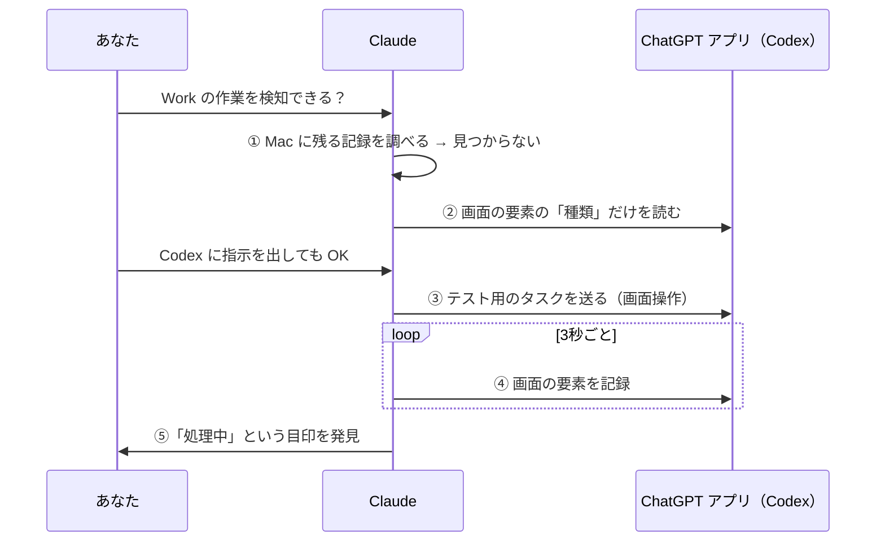

# 🔰 AI と一緒にアプリを作った記録 ─ Claude & Codex Usage ができるまで

プログラミングの経験が少なくても、AI に「こうしたい」を伝え続けることで、Mac のアプリを作って GitHub に公開するところまでできました。このページは、その過程で**うまくいった指示の出し方**と、**AI 同士（Claude と Codex）を連携させた方法**をまとめた制作記録です。

---

## 登場人物

| 名前 | 役割 |
|---|---|
| **あなた（作る人）** | やりたいことを伝える、見た目を判断する、許可を出す |
| **Claude**（Claude デスクトップアプリの Code） | 調査・設計・コードを書く・動作確認・GitHub への公開 |
| **Codex**（ChatGPT アプリ） | 作業風景の最初の試作を作った。後半では「実験台」として協力 |

---

## できるまでの流れ

| # | あなたの一言 | AI がやったこと | 結果 |
|---|---|---|---|
| 1 | 「残りの使用量を Mac で見たい。ウィジェットで」 | 既存ツール（CodexBar など）を調べ、Mac の中でどう動かせるかを確認 | デスクトップに置けるガラス風ウィジェットが完成 |
| 2 | 「余裕があるときは緑や水色にしたい」 | 使用率で色が変わる仕組みを追加 | 色の段階（水色 → 緑 → …） |
| 3 | 「Codex も1つのアプリで見たい」 | Codex CLI の公式の仕組みで使用量を取得 | Claude と Codex を並べて表示 |
| 4 | 「メニューバーにキャラクターを置きたい」 | ドット絵のキャラクターを描き、残量で体が満ちる表現に | メニューバーの小さなキャラクター |
| 5 | 「名前がピンとこない」「GitHub に出したい」 | 名前の候補を出し、公開前に個人情報をチェック | GitHub で公開 |
| 6 | 「作業風景を見てほしい」（Codex が作った試作） | 試作をレビュー。不具合を実データで見つけて修正 | 「作業中」「確認待ち」「完了」を表示 |
| 7 | 「設定がメニューだと毎回閉じる」 | 閉じないパネル（使用量／設定タブ）に作り直し | 設定がまとめてできるように |
| 8 | 「毎回色を指示するのは大変」 | 色の段階を**自分で編集できる**設定を追加 | 今後は AI に頼まず調整できる |
| 9 | 「終わったのに気づかない」 | アプリの未読マークのような**青い丸**と、手を振る動きを追加 | 放置していても完了がわかる |
| 10 | 「ChatGPT の Work を検知できる？」 | **Claude が ChatGPT アプリにテストを送り、動きを観察**（下で詳しく） | 検知に使える目印を発見 |

---

## 指示の出し方のコツ（うまくいったこと）

### 1. スクリーンショットを貼る
「ここの色が」「この表示が」と言葉で説明するより、画面を貼るほうが一発で伝わります。矢印を描き込むとさらに確実です。

### 2. 好き・嫌いをそのまま言う
「最初の片手で打つ動きが良かった」と伝えたところ、AI は過去の版を覚えていて、そのまま復元できました。**「前のほうが良かった」は立派な指示です。**

### 3. 候補を出してもらって選ぶ
名前・色の段階・動きなど、正解がないものは「候補を出して」と頼むと決めやすくなります。選択肢の画面で答えるだけで進みます。

### 4. 実物を並べて比べてもらう
「色の段階」「メニューバーの表示スタイル」「2種類の動き」などは、AI に**比較画像**を作ってもらってから選びました。

| 色の段階 | 設定パネル |
|:---:|:---:|
|  |  |

### 5. 何度も変えそうなものは「設定」にしてもらう
色の好みは変わります。毎回指示する代わりに、**パネルで自分で編集できる**ようにしてもらいました。

### 6. 「自由にやって」と任せるところは任せる
「配置などでよくできることがあれば、自由にやって」と任せた部分から、パネル化などの大きな改善が生まれました。

### 7. わからない言葉はその場で聞く
「コミットとプッシュってどう違うの？」のような質問も、作業の途中で気軽に聞けます（下の用語集も参考に）。

### 8. 返事の言語を伝える
長いやり取りの途中で英語の返事が混ざったことがありました。「日本語で」と伝えれば直ります。

---

## AI にやってもらった「確かめ方」

作って終わりではなく、毎回次のように確認してもらいました。

- **実際の画面で確認**：ウィジェットやパネルを実際に表示してスクリーンショットで確認
- **負荷を測る**：CPU の使用率を測り、重い部分は作り直し（9% → 2〜3%）
- **自動チェック**：作業状態の検知を 36 項目のテストで確認
- **公開前のチェック**：トークン（鍵）や個人情報が入っていないかを毎回検索

---

## 🤝 Claude と Codex の連携 ─ AI が別の AI を「実験台」にして調べた話

### 困りごと
ChatGPT の **Work** をウェブ版で始めて、ChatGPT アプリで同じチャットを見ていても、ウィジェットの Codex キャラクターは「待機中」のままでした。

### Claude の調べ方

1. **Mac に残る記録を調べる**：ファイルの更新時刻だけを見て、Work は OpenAI のサーバー（クラウド）で動くため、Mac には記録が残らないことを確認しました。
2. **画面の要素を読む**：macOS のアクセシビリティ機能を使い、チャットの内容ではなく「ボタン」「ステータス」といった要素の**種類だけ**を数えました。
3. **テスト用のタスクを送る**：あなたから「Codex に指示を出しても OK」と許可をもらい、Claude が ChatGPT アプリを操作して、短いテストのタスク（「1 から 20 まで一言コメント付きで」）を送りました。
4. **動いている最中と終わった後を比べる**：タスクが動いている間、3 秒ごとに画面の要素を記録し、終わった後と比べました。
5. **目印を発見**：動いている間だけ「**処理中**」というステータスが出て、終わると消えることがわかりました。これを使えば「作業中 → 完了」を検知できます。

### ここがポイント
- **AI 同士を実験台にできる**：実際に動かして比べれば、推測ではなく確実な目印が見つかります。
- **許可を出すのは人間**：別のアプリへの操作やメッセージ送信は、あなたが許可してから行いました。
- **中身は読まない**：チャットのタイトルや内容は読まず、要素の種類だけで判断しました。
- **テストの後片付け**：テスト用のチャットが ChatGPT に残るので、不要なら削除します。

> この目印を使ったウィジェットへの組み込みは、次のステップです（macOS のアクセシビリティの許可が必要になります）。

---

## つまずいたこと・失敗から学んだこと

| できごと | 原因 | 対策 |
|---|---|---|
| 「取得制限中」と表示された | テストでアプリを何度も再起動し、使用量の API を呼びすぎた | 取得の間隔を空け、制限中は自動で待つように |
| CPU が一時 100% に | アニメーションの時間の区切りの計算ミス | すぐ止めて修正。**負荷を測る習慣**が役に立った |
| 青い丸が見えない | 作業が終わった瞬間にアプリを見ていたので「確認済み」扱いに | 仕様どおり。別のアプリを見ている間に終わると表示される |
| メールアドレスが公開されていた | 別のリポジトリで、コミットに実際の Gmail が記録されていた | GitHub の非公開用アドレスに書き換え、設定で再発を防止 |
| 名前がしっくりこない | 最初は機能より先に名前を付けた | 公開前に見直して「Claude & Codex Usage」に |

---

## 用語ミニ辞典

| 用語 | ひとことで |
|---|---|
| **コミット** | 変更を「ひとまとまりの記録」として**自分の Mac に**保存すること |
| **プッシュ** | その記録を **GitHub に送って**公開すること |
| **ブランチ** | 本体（main）とは別の「作業用の枝」。試作はここで作る |
| **マージ** | 枝の変更を本体に合流させること |
| **README** | リポジトリのトップに表示される説明書 |
| **ビルド** | ソースコードからアプリを作ること（`./build.sh install`） |
| **API** | アプリ同士がデータをやり取りするための窓口 |
| **アクセシビリティ** | 画面読み上げなどのための、画面の要素を読み取れる仕組み |

---

## このアプリ作りで使った一言テンプレート

- 「これ、〇〇できますか？ 既にいい方法でやっている人がいれば参考にして」
- 「〇〇が見づらいので、〇〇にしてほしい」（スクショ付き）
- 「前の〇〇のほうが良かった。戻せる？」
- 「候補をいくつか出して」
- 「毎回指示しなくていいように、設定で変えられるようにして」
- 「ここまでで OK なのでコミットして」「GitHub にも上げて（プッシュ）」
- 「解決しそうなら Codex に指示を出しても OK」
